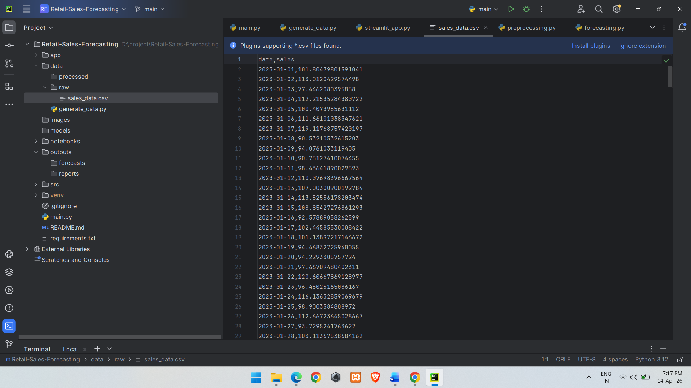
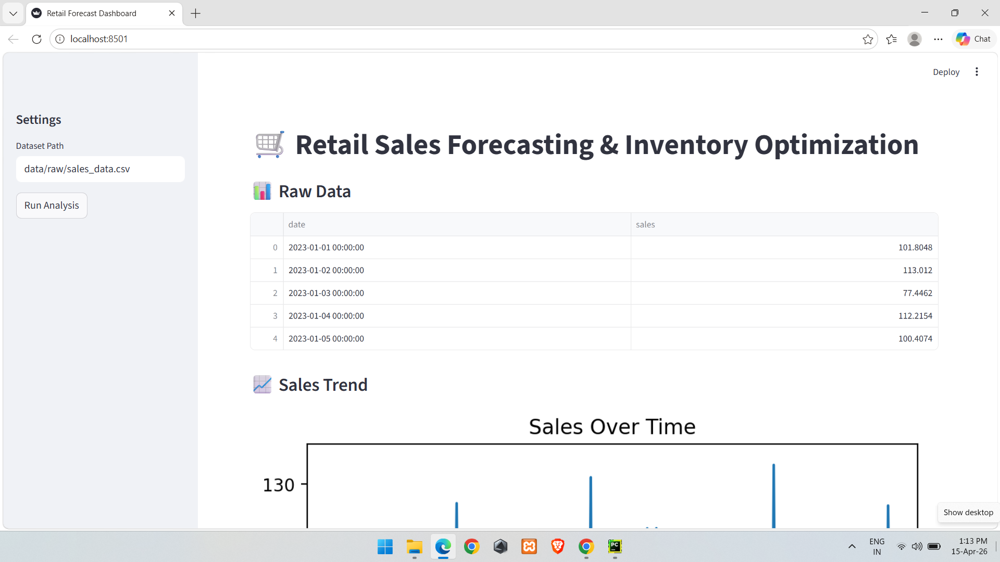
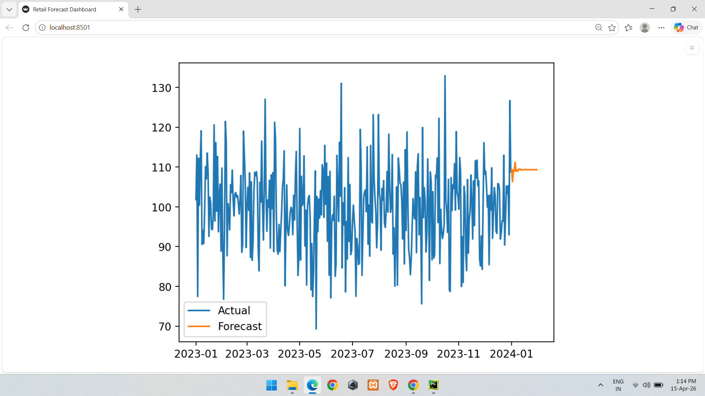
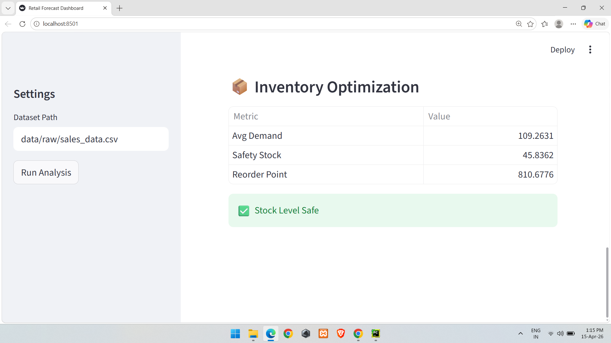

# Retail Sales Forecasting & Inventory Optimization

## Overview
This project predicts retail sales and optimizes inventory.

## Tech Stack
Python, Pandas, ARIMA, Streamlit

## Features
- Sales Forecasting
- Inventory Optimization
- Reorder Point Calculation

## Run
python main.py
## 📊 Output Screenshots

